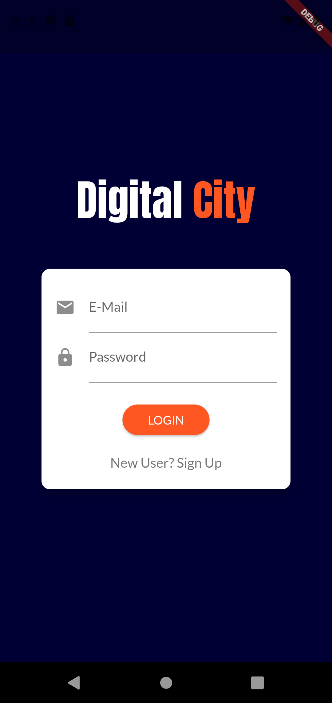
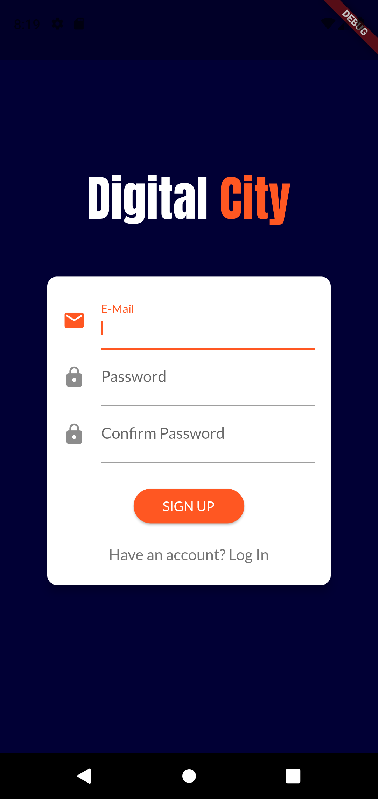
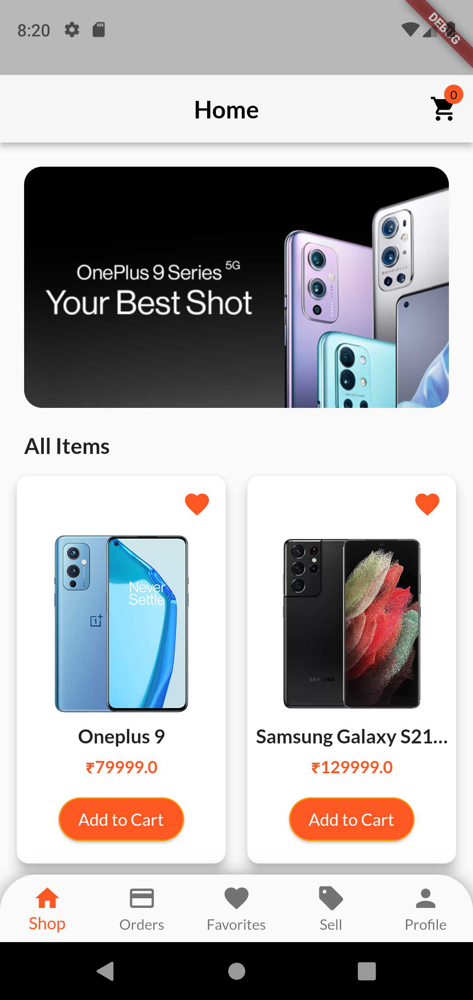
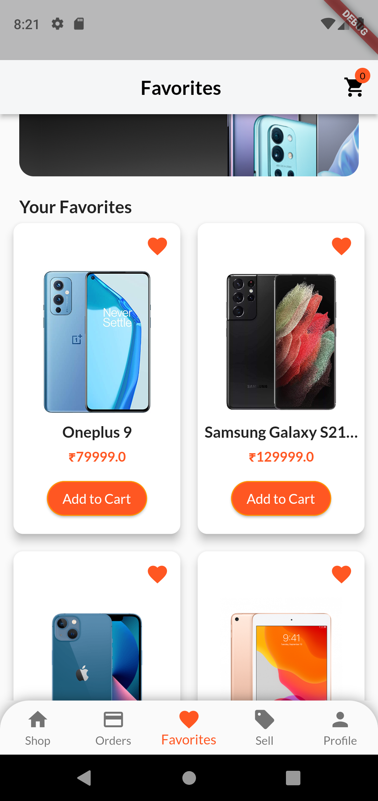
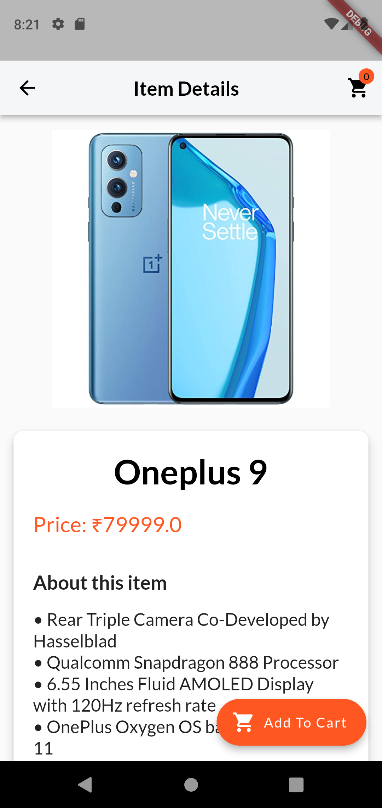
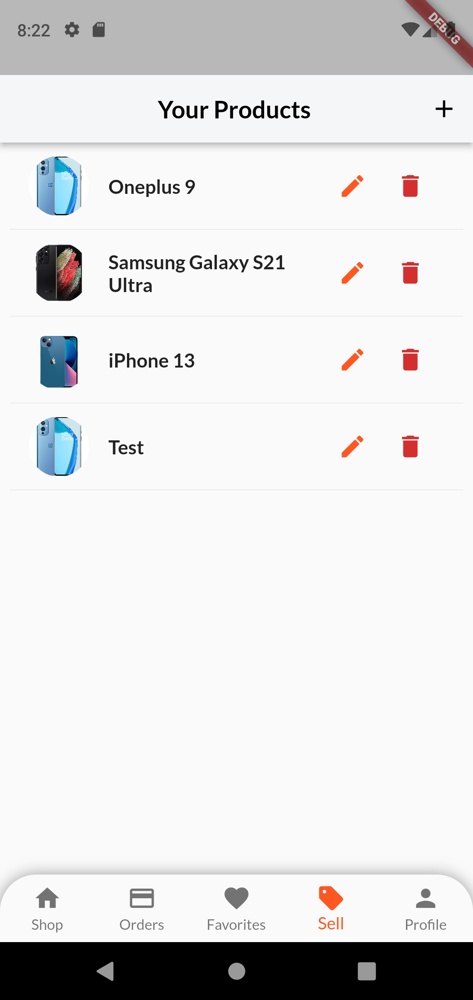
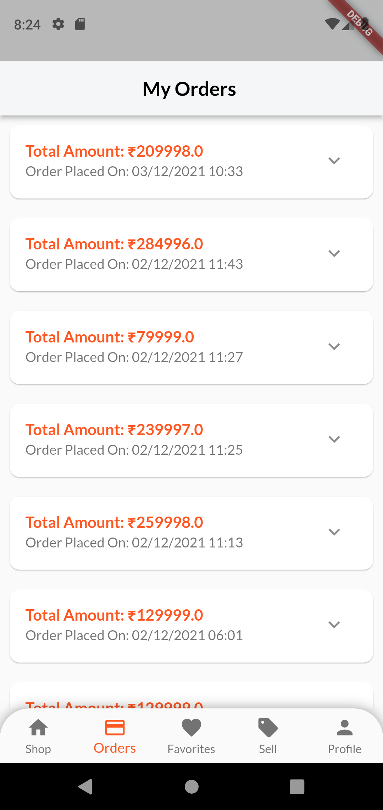
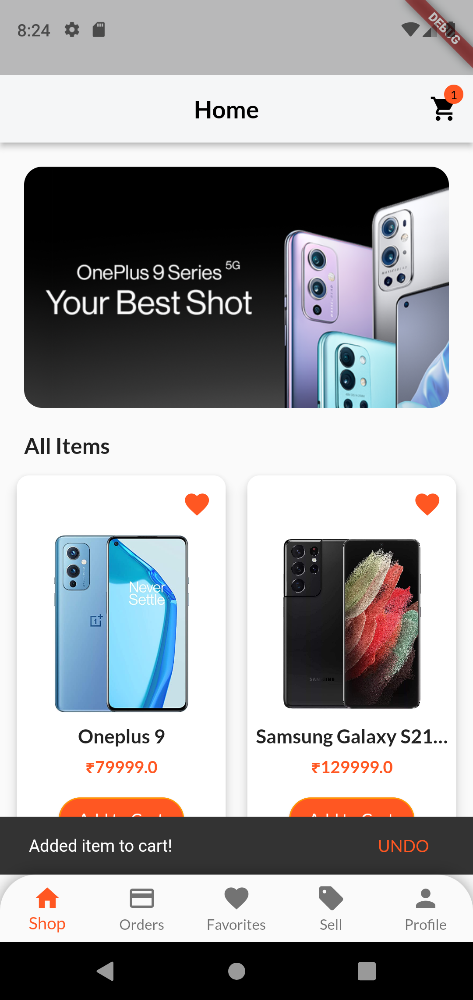
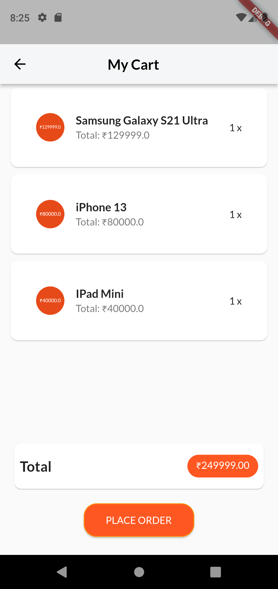
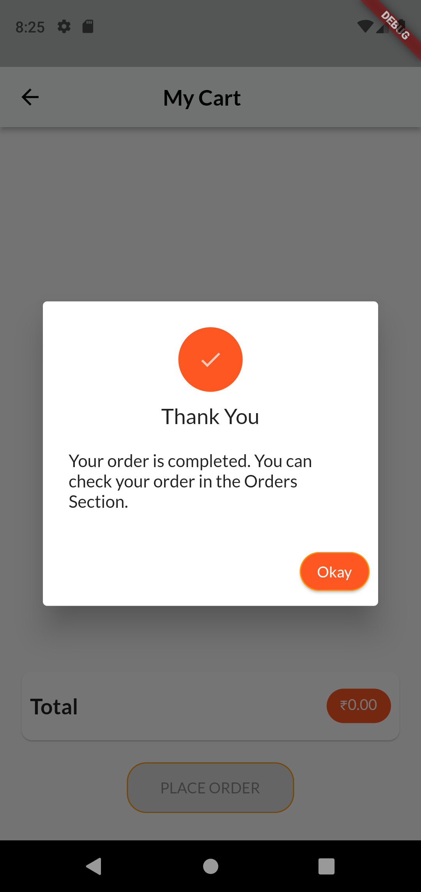

# DIGITALCITY

In our project we aim at developing an app for an electronics shop -Digital City . This easy-to-use app will cover basic user authentication.A user can browse and order various electronic products available in the store.Besides,some additional features such as user wishlists,various filters and confirmation pop ups have been integrated in this user friendly app.
 
## Functionalities

1. Users will be able to Sign Up and Login through the app.
2. Users will be able to see all the items available on our app on the homepage.
3. Users will be able to Filter the items based on categories.
4. Users will be able to add items to their Wishlist by clicking on the ‘heart’ icon.
5. Users will be able to see all the details of an item such as Name, Description, storage , color variants ,Price when they click on the items.
6. Users will also be able to add products to their cart from the item details page.
7. Users will be able to see all the items added to cart along with their prices, quantity and the sum total in the ‘My Cart’ page.
8. Users will be able to add addresses from the ‘My Cart’ Page.
9. Users will receive a confirmation pop up on placing their order successfully.
10. Users will be able to view their personal information such as ‘Name and ‘E-mail’ and will be able to access options such as ‘Your Orders’ , ‘Add Address’ , ‘Contact Us’ and will be able to log out from the Profile Page.
11. Users will be able to View all their Past orders in the ‘My Orders’ Page.


## Tech Used

- Flutter
- Firebase

## Running this project
 

1. Clone this repository
2. Run the following command in the root of the project to install the dependencies

```sh
$ flutter pub get
```

3. Run your android emulator or connect your physical device (after enabling developer options and USB debugging) and run the following command in the root of the project

```sh
$ flutter run
```

## Images

|  |  |  |  |
|---|---|---|---|
|  |  |  |  |
|My Cart Page|Order Confirmation Page|Profile Page|---|
|  |  |  | 
